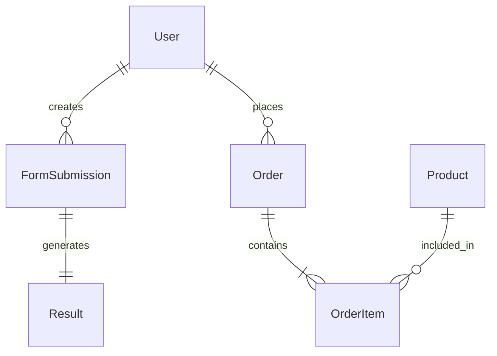

# Backend Architecture

The backend follows a **Layered Architecture** pattern to ensure separation of concerns, maintainability, and scalability.

## 🏗️ High-Level Structure

```mermaid
graph TD
    Client[Client (Frontend/Postman)] -->|HTTP Request| API[Express API Layer]
    API -->|Route| Controller[Controllers]
    Controller -->|Call| Service[Services]
    Service -->|Uses| Model[Mongoose Models]
    Model -->|Query| DB[(MongoDB)]
    
    subgraph Layers
    API
    Controller
    Service
    Model
    end
```

## 📂 Directory Structure
- **`src/config`**: Database connection configuration.
- **`src/controllers`**:
  - `authController.ts`: Handles registration, login, and user profile.
  - `formController.ts`: Manages health data submissions.
  - `resultController.ts`: Generates and retrieves weight loss plans.
  - `productController.ts`: Manages the e-commerce catalog.
  - `orderController.ts`: Handles checkout and order management.
- **`src/services`**: Business logic layer (e.g., `formService.ts`, `resultService.ts`) called by controllers.
- **`src/models`**: Mongoose schemas defining the data structure.
- **`src/routes`**: API route definitions mapping endpoints to controllers.
- **`src/middleware`**: `auth.ts` (JWT), `errorHandler.ts`, and validation middleware.

## 🔑 Key Components

### Authentication
- Uses **JWT (JSON Web Tokens)** for stateless authentication.
- **`authMiddleware`**: Verifies the token and attaches the user to the request object.
- **RBAC**: Middleware checks for roles (e.g., `admin`).

### Validation
- **Zod** is used for runtime schema validation.

### Error Handling
- A centralized **Error Handling Middleware** intercepts all errors.

## 💾 Data Models & Relationships

- **`User.ts`**: Stores email, password hash, name, and roles.
- **`FormSubmission.ts`**: Stores raw user inputs (gender, bmi, calories, water, days, weightLoss).
- **`Result.ts`**: Stores the generated weekly plan and calculated stats.
- **`Product.ts`**: Store items for sale (sku, name, price, stock).
- **`Order.ts`**: Stores purchase details, shipping info, and status.



## 🛡️ Security Measures
- **Helmet**: Sets secure HTTP headers.
- **CORS**: Restricts access to allowed domains.
- **Rate Limiting**: Prevents abuse of endpoints (specifically auth and payment).
- **Password Usage**: Passwords are hashed using `bcrypt` before storage.
